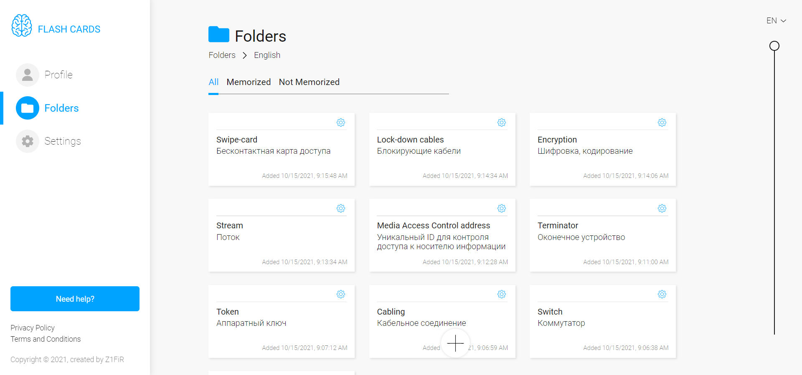

<h1 id="top" align="center" style="font-weight:">Flash Cards</h1>

<h3 align="right" style="font-weight:">
  Try <a href="https://zif1r.github.io/flash-cards-new/">Live Demo</a>
</h3>

<details>
  <summary>Table of contents:</summary>
  <ul>
    <li><a href="#description">Short review of project</a></li>
    <ul>
      <li><a href="#facilities">Main facilities</a></li>
      <li><a href="#stack">Technological stack</a></li>
    </ul>
    <li><a href="#screenshots">Screenshots</a></li>
    <ul>
      <li><a href="#profile">Profile page</a></li>
      <li><a href="#folders">Folders page</a></li>
      <li><a href="#cards">Cards page</a></li>
      <li><a href="#settings">Settings page</a></li>
      <li><a href="#review">Review pop-up</a></li>
    </ul>
    <li><a href="#notes">Notes of usage</a></li>
    <ul>
      <li><a href="#import">Import</a></li>
    </ul>
    <li><a href="#setup">Project setup</a></li>
  </ul>
</details>

<br>

<h1 id="description" style="font-size: 27px">Short review of project</h1>

<h2 id="facilities" style="text-decoration: underline">Main facilities</h2>

- Registration/Authorization
- Changing app language (EN/RU/JP)
- Changing profile data
- Adding folders/cards/categories and editing it
- Training by cards
- Checking memorized and not memorized cards
- Setting app theme/cards review
- Export/Import of cards

<h2 id="stack" style="text-decoration: underline">Technological stack</h2>

- Vue.js & Vuex & Vue Router
- Firebase (database)
- JavaScript
- Sass

<h1 id="screenshots">Screenshots</h1>

<h3 id="profile">Profile page</h3>


<br>

<h3 id="folders">Folders page</h3>


<br>

<h3 id="settings">Settings page</h3>


<br>

<h3 id="cards">Cards page</h3>



<br>

<h3 id="review">Review pop-up</h3>


<br>

<h1 id="notes">Notes of usage</h1>

<h2 id="import">Import</h2>

Import-file should be in JSON format and have such structure:

```json
[
  {
    "term": "Example term1",
    "definition": "Пример перевода",
    "examples": "Examples of usage"
  },
  {
    "term": "Example term2",
    "definition": "Пример перевода",
    "examples": "Examples of usage"
  },
]
```

<h1 id="setup">Project setup</h1>

### Download dependencies
```
npm install
```

### Compiles and hot-reloads for development
```
npm run serve
```

### Compiles and minifies for production
```
npm run build
```

### Lints and fixes files
```
npm run lint
```
